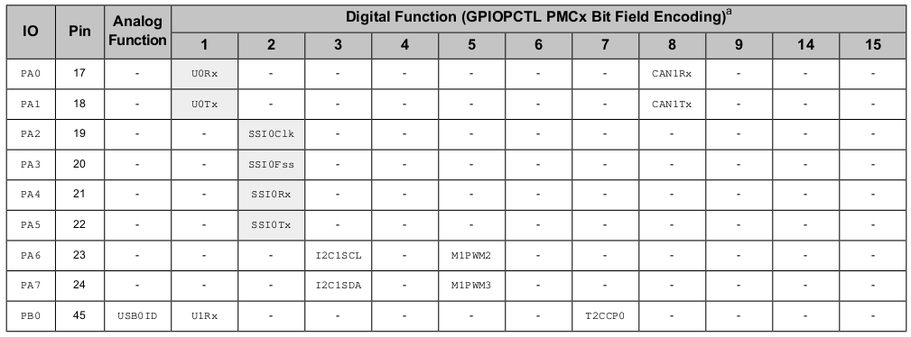
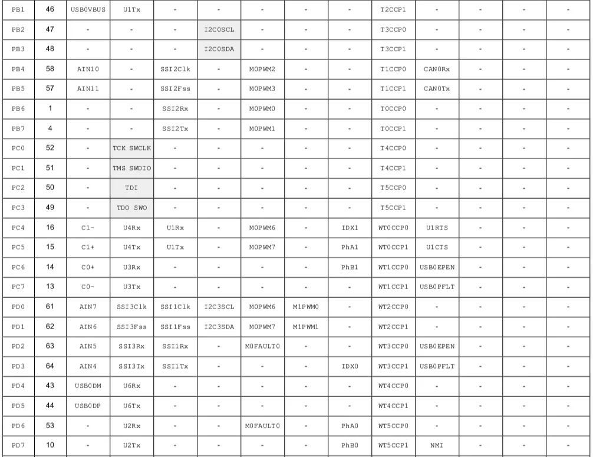

# Microprocessors: CA2
## GPIO Pins and Alternate Functions






## Register Map

| **GPIO Port A (APB)** | 0x4000.4000 |
| --- | --- |
| **GPIO Port B (APB)** | 0x4000.5000 |
| **GPIO Port C (APB)** | 0x4000.6000 |
| **GPIO Port D (APB)** | 0x4000.7000 |
| **GPIO Port E (APB)** | 0x4002.4000 |
| **GPIO Port F (APB)** | 0x4002.5000 |

### GPIO Alternate Function Select (GPIOAFSEL), offset 0x420


### GPIO Digital Enable (GPIODEN), offset 0x51C

<aside>
💡

*Note: Pins configured as digital inputs are Schmitt-triggered.*

The GPIODEN register is the digital enable register. By default, all GPIO signals except those listed below are configured out of reset to be undriven (tristate). Their digital function is disabled; they do not drive a logic value on the pin and they do not allow the pin voltage into the GPIO receiver. To use the pin as a digital input or output (either GPIO or alternate function), the corresponding GPIODEN bit must be set.

</aside>


### GPIO Analog Mode Select (GPIOAMSEL), offset 0x528


### GPIO Port Control (GPIOPCTL), offset 0x52C


## GPIO Direction (GPIODIR), offset 0x400


## GPIO Pull-Up Select (GPIOPUR), offset 0x510


## Steps (Digital Input/Output)

1. Activate clock (SYSCTL_RCGCGPIO_R)
    
    ```nasm
    ; activate clock for Port E (and F)
    LDR R1, =SYSCTL_RCGCGPIO_R 		; R1 = address of SYSCTL_RCGCGPIO_R
    LDR R0, [R1]                	; 
    ORR R0, R0, #0x30           	; turn on GPIO E&F clock
    STR R0, [R1]                  
    NOP								; allow time for clock to finish
    NOP
    NOP
    ```
    
2. Configure (disable) analog mode (GPIO_PORT#_AMSEL_R)
    1. Set the bit(s) corresponding to desired pins to 0 to disable analog functionality
    
    ```nasm
    ; disable analog functionality
    LDR R1, =GPIO_PORTF_AMSEL_R     
    LDR R0, [R1]                    
    BIC R0, #0x0E                  	; 0 means analog is off
    STR R0, [R1] 
    ```
    
3. Configure port control (GPIO_PORT#_PCTL_R)
    1. Set the PMC (byte) corresponding to the desired pins to 0 for GPIO function
    
    ```nasm
    ;configure as GPIO
    LDR R1, =GPIO_PORTF_PCTL_R      
    LDR R0, [R1]   
    BIC R0, R0,	#0x00000FF0			    ; Clears bit 1 & 2
    BIC R0, R0, #0x000FF000         ; Clears bit 3 & 4
    STR R0, [R1]  
    ```
    
4. Configure direction (GPIO_PORT#_DIR_R)
    1. Set the corresponding bit to configure pin direction = {0: Input, 1: Output}
    
    ```nasm
    ;set direction register
    LDR R1, =GPIO_PORTF_DIR_R       
    LDR R0, [R1]                    
    ORR R0, R0, #0x0E               ; PF 1,2,3 output 
    BIC R0, R0, #0x10               ; Make PF4 built-in button input
    STR R0, [R1]    
    ```
    
5. Configure alternate function (GPIO_PORT#_AFSEL_R)
    1. Set the bit(s) corresponding to desired pins to 0 for default GPIO function
    
    ```nasm
    ; regular port function
    LDR R1, =GPIO_PORTF_AFSEL_R     
    LDR R0, [R1]                     
    BIC R0, R0, #0x1E               ; 0 means disable alternate function
    STR R0, [R1] 
    ```
    
    ***Step 6 for input switches only***
    
6. Configure pull-up resistors (GPIO_PORT#_PUR_R)
    1. Set the corresponding bit to configure pull-up resistor = {0: Disabled, 1: Enabled}
    
    ```nasm
    ; pull-up resistors on switch pins
    LDR R1, =GPIO_PORTA_PUR_R      	; 
    LDR R0, [R1]                   	; 
    ORR R0, R0, #0xF0              	; enable pull-up on PortA bit 4-7
    STR R0, [R1]      
    ```
    
7. Configure digital enable (GPIO_PORT#_DEN_R)
    1. Set the corresponding bit to 1 to enable digital functionality
    
    ```nasm
    ; enable digital port
    LDR R1, =GPIO_PORTF_DEN_R       
    LDR R0, [R1]                    
    ORR R0,#0x0E                    ; 1 means enable digital I/O
    ORR R0, R0, #0x10               ; R0 = R0|0x10 (enable digital I/O on PF4)
    
    ```
    

---

<aside>
💡

The following GPIO pins control the onboard LEDs and switches.

PF0                EQU 0x40025004	; 	SW2 - negative logic
PF1                EQU 0x40025008	;	RED LED
PF2                EQU 0x40025010	; 	BLUE LED - ORIG
PF3                EQU 0x40025020	;	GREEN LED
PF4                EQU 0x40025040	;	SW1 - ORIG -negative logic
PFA                EQU 0x40025038	; 	3 colours

</aside>

## GPIO : Analog Pin

| **Port / GPIO** | **Analog** |
| --- | --- |
| PB4 | AIN10 |
| PB5 | AIN11 |
| PD0 | AIN7 |
| PD1 | AIN6 |
| PD2 | AIN5 |
| PD3 | AIN4 |
| PE0 | AIN3 |
| PE1 | AIN2 |
| PE2 | AIN1 |
| PE3 | AIN0 |
| PE4 | AIN9 |
| PE5 | AIN8 |

## Steps (Analog Input)

**Configuration**

1. Activate clock (SYSCTL_RCGCGPIO_R)
    1. 
    
    ```nasm
    SYSCTL_RCGCGPIO_R  	EQU 0x400FE608		; GPIO run mode clock gating control
    
    LDR R1, =SYSCTL_RCGCGPIO_R 		; R1 = address of SYSCTL_RCGCGPIO_R
    LDR R0, [R1]                	; 
    ORR R0, R0, #0x30           	; turn on GPIO E&F clock
    STR R0, [R1]                  
    NOP								; allow time for clock to finish
    NOP
    NOP
    ```
    
2. Configure (Enable) alternate function (GPIO_PORT#_AFSEL_R)
    1. 
    
    ```nasm
    GPIO_PORTE_AFSEL_R 	EQU 0x40024420
    
    LDR R1, =GPIO_PORTE_AFSEL_R     
    LDR R0, [R1]                     
    ORR R0, R0, #0x20      			; enable alternate function on PE4/5
    STR R0, [R1] 
    
    ```
    
3. Configure (Disable) digital port (GPIO_PORT#_DEN_R)
    1. 
    
    ```nasm
    GPIO_PORTE_DEN_R   	EQU 0x4002451C
    
    LDR R1, =GPIO_PORTE_DEN_R   	
    LDR R0, [R1]                    
    BIC R0, R0, #0x20               ; disable digital I/O on PE4/5
    STR R0, [R1]    
    ```
    
4. Configure (Enable) analog mode (GPIO_PORTE_AMSEL_R)
    1. 
    
    ```nasm
    GPIO_PORTE_AMSEL_R 	EQU 0x40024528
    
    LDR R1, =GPIO_PORTE_AMSEL_R     
    LDR R0, [R1]                    
    ORR R0, R0, #0x20    			; enable PE4/5 analog function
    STR R0, [R1]    
    ```
    
5. Activate ADC clock (SYSCTL_RCGCADC_R)
    1. 
    
    ```nasm
    SYSCTL_RCGCADC_R 	EQU 0x400FE638		; ADC run mode clock gating control
    
    LDR R1, =SYSCTL_RCGCADC_R 		 
    LDR R0, [R1]                	 
    ORR R0, R0, #0x01           	; activate ADC0 (NTS: There are 2 ADC modules that can accept any AIN pins as inputs using MUX)
    STR R0, [R1]                  
    
    BL Delay						; delay subroutine -> allow time for clock to finish
    ```
    
6. Configure ADC Sample Phase Control (ADC0_PC_R/ADCSPC)
    1. 
    
    ```nasm
    ADC0_PC_R           EQU	0x40038FC4
    
    LDR R1, =ADC0_PC_R       
    LDR R0, [R1]           
    BIC R0, R0, #0x0F				; clear max sample rate field
    ORR R0, R0, #0x1     			; configure for 125K samples/sec
    STR R0, [R1]
    ```
    
7. Configure sample sequencer priority (ADC0_SSPRI_R/ADCSSPRI)
    1. 
    
    ```nasm
    ADC0_SSPRI_R        EQU	0x40038020
    
    LDR R1, =ADC0_SSPRI_R       
    LDR R0, =0x0123           		; SS3 is highest priority
    STR R0, [R1]    
    ```
    
8. Configure Trigger Source Select (ADC0_ACTSS_R/ADCTSSEL)
    1. 
    
    ```nasm
    ADC0_ACTSS_R   		EQU 0x40038000
    
    LDR R1, =ADC0_ACTSS_R       
    LDR R0, [R1]           
    BIC R0, R0, #0x08				; disable SS3 before configuration to 
    STR R0, [R1]    				; prevent erroneous execution if a trigger event were to occur
    ```
    
9. Configure Event Multiplexer Select (ADC0_EMUX_R/ADCEMUX
    1. 
    
    ```nasm
    ADC0_EMUX_R			EQU	0x40038014
    
    LDR R1, =ADC0_EMUX_R       
    LDR R0, [R1]           
    BIC R0, R0, #0xF000				; SS3 is software trigger
    STR R0, [R1]    
    ```
    
10. Configure Sample Sequence Input Multiplexer Select (ADC0_SSMUX3_R/ADCSSMUX3)
    1. Set channel to input pin (AIN#)
    
    ```nasm
    ADC0_SSMUX3_R       EQU 0x400380A0
    
    LDR R1, =ADC0_SSMUX3_R      
    LDR R0, [R1]           
    BIC R0, R0, #0x000F				; clear SS3 field
    ADD R0, R0, #9					; set channel -> select input pin AIN9/8 (IMPT NTS: Here is where the AIN pin is selected to be read by the ADC Module)
    STR R0, [R1]    
    ```
    
11. Configure Sample Sequence Control (ADC0_SSCTL3_R/ADCSSCTL3)
    
    ```nasm
    ADC0_SSCTL3_R       EQU	0x400380A4
    
    LDR R1, =ADC0_SSCTL3_R       	; NTS: 0x0006 = 0b 0000.0000.0000.0110 Each group of 4 bits describes how the samples are taken.
    LDR R0, =0x0006           		; 0110 configures Sample 1: not reading Temp sensor, not differentially sampled, assert raw interrupt signal at the end of conversion, first sample is last sample.
    STR R0, [R1]    				; NTS: Not reading temp sensor == "The input pin specified by the ADCSSMUXn register is read during the first sample of the sample sequence"   
    ```
    
12. Configure Interrupt Mask (ADC0_IM_R/ADCIM)
    
    ```nasm
    ADC0_IM_R           EQU 0x40038008
    
    LDR R1, =ADC0_IM_R     
    LDR R0, [R1]           
    BIC R0, R0, #0x0008				; disable SS3 interrupts
    STR R0, [R1]    
    ```
    
13. Configure Active Sample Sequencer (ADC0_ACTSS_R/ADCACTSS)
    
    ```nasm
    ADC0_ACTSS_R   		EQU 0x40038000
    
    LDR R1, =ADC0_ACTSS_R      
    LDR R0, [R1]           
    ORR R0, R0, #0x0008     		; enable SS3
    STR R0, [R1]    
    ```
    

**During Reading**

1. Initiate sampling in ADCPSSI
    
    ```nasm
    ADC0_PSSI_R			EQU 0x40038028
    
    LDR R1, =ADC0_PSSI_R      
    MOV R0, #0x08					; initiate sampling in the SS3  (Sample Sequencer)
    STR R0, [R1]    
    ```
    
2. Check raw interrupt status in ADCRIS
    
    ```nasm
    ADC0_RIS_R			EQU	0x40038004		; Raw interrupt status - set to 1 when conversion completed by SS
    
    LDR R1, =ADC0_RIS_R   			; R1 = address of ADC Raw Interrupt Status (This register stores the interrupt status, which updates to 1 whenever a sample has completed conversion)
    LDR R0, [R1]           			; check end of a conversion
    CMP	R0, #0x08    				    ; when a sample has completed conversion -> a raw interrupt is enabled
    BNE	Loop
    ```
    
3. If true, load result from ADCSSFIFO1 into memory
    
    ```nasm
    ADC0_SSFIFO3_R		EQU	0x400380A8		; Data FIFO - cleared from buffer once read
    
    LDR R1, =ADC0_SSFIFO3_R			; load SS3 result FIFO into R1
    LDR R0,[R1]
    LDR R2, =Result					; store data
    STR R0,[R2]
    ```
    
4. Clear interrupt status from ADCISC
    
    ```nasm
    ADC0_ISC_R			EQU	0x4003800C	
    
    LDR R1, =ADC0_ISC_R
    LDR R0, [R1]
    ORR R0, R0, #08					; acknowledge conversion by clearing the interrupt status
    STR R0, [R1]
    ```